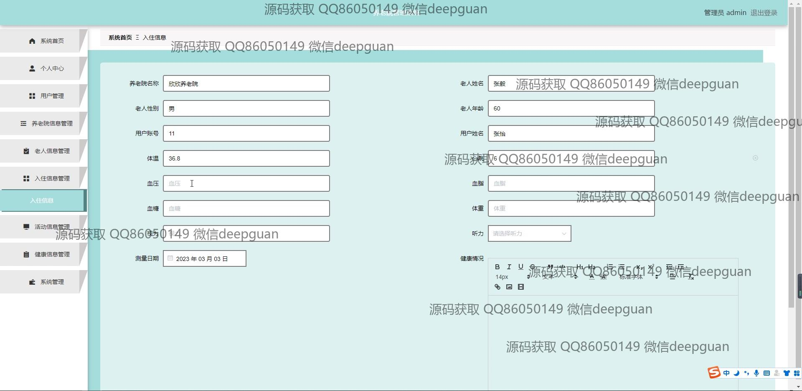

<h1 align="center">养老院管理系统</h1>

## 简介
养老院管理系统：采用Spring Boot框架，角色分为管理员与用户；包含功能有用户管理、老人信息管理、入住信息管理、活动信息管理及健康信息管理，提供综合的养老院信息与服务管理。    --计算机毕业设计源码；毕设源码；java毕业设计源码

## 联系方式

<h3 align="center">获取完整代码与数据库文件 + 微信：deepguan QQ: 86050149 QQ群: 783742310</h3>

<h3 align="center">可帮忙远程部署 包运行成功！提供远程部署、修改代码、设计文档指导、代码讲解等服务！</h3>

## 功能介绍（完整见运行截图）
管理员：基本功能包括登录、注册和退出。登录管理系统后，可以通过导航栏访问个人中心、用户管理、养老院信息管理、老人信息管理、入住信息管理、活动信息管理、健康信息管理和系统管理模块。系统支持添加、编辑和删除用户账号，管理养老院基本信息，维护老人健康数据，安排活动，管理入住信息及发布养老院公告。管理员还可管理系统主页的轮播图及热门信息展示，确保数据的准确性和完整性。

用户：用户可以进行账号登录和注册，通过系统首页导航栏访问个人中心、养老院信息、活动信息及养老院公告模块。在个人中心，用户可以查看和编辑个人基本信息，如姓名、性别和联系方式。用户能够浏览和申请入住养老院，查看活动信息，参与健康管理。系统支持老人信息录入，用户可在申请过程中上传必要的文件及填写个人健康信息，不同用户角色获得不同权限以保障信息安全。

## 运行截图

本代码来源于网络,仅供学习参考使用!

